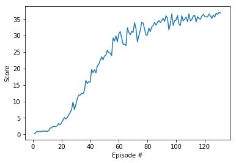

# Learning Algorithm

The agent that solves the environment is trained using **Deep Deterministic Policy Gradient** . The local and target networks of the actor and the critic have two hidden fully connected layers with 256 and 128 units. The environment is solved in approximately 131 episodes. 

# Rewards

The following figure exhibits the average score over 20 agents obtained in each of the 131 episodes. The trainings stops after reaching an average reward of +30 in 100 consecutive episodes.

## Ideas for Future Work

Some other algorithms that can be applied to a continuos control task might be tested in this enviroment to check if better results might be obtained. 

Additionally, certain hyperparameters such as the number of hidden layers, the number of units of the networks, learning rates and batch size might be adjusted in order to imrpove the results using grid search or bayesian optimization.

# 